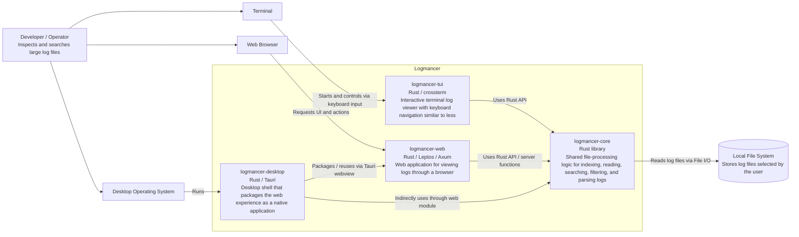

# Containers

This document describes Logmancer at C4 Level 2: the major runtime and source-code containers that make up the system.

## C4 Level 2: Container Diagram

## Containers

### logmancer-core

Shared Rust library containing the core log-processing capabilities. It owns the reusable logic for reading from disk, indexing files, searching, filtering, and parsing log lines.

### logmancer-tui

Interactive terminal application for inspecting logs directly from a shell. It depends on `logmancer-core` for file and log operations and focuses on terminal rendering, keyboard input, and viewer navigation.

### logmancer-web

Leptos and Axum-based web application. It exposes Logmancer through a browser-based interface while reusing `logmancer-core` for the underlying log operations.

### logmancer-desktop

Tauri-based desktop application. It packages the web experience as a native desktop app and leverages the same core behavior through the web module integration.

## Key Dependency Direction

Application surfaces depend on `logmancer-core`; the core library does not depend on any UI container. This keeps log-processing behavior reusable across terminal, web, and desktop distributions.
