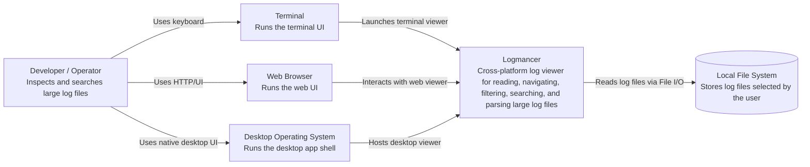

# System Context

This document describes Logmancer at C4 Level 1: the system in its environment and the people or external systems that interact with it.

## Scope

Logmancer is a lightweight, cross-platform log viewer written in Rust. It helps developers and operators inspect large log files efficiently through terminal, web, and desktop interfaces.

## C4 Level 1: System Context

## Main Responsibilities

- Read large log files efficiently from disk.
- Navigate logs with viewer-like controls, including line scrolling and jump-to-start/end behavior.
- Search and filter log content using regular expressions.
- Parse log lines into structured columns when a supported or custom pattern is available.
- Provide multiple delivery surfaces: terminal UI, web app, and desktop app.

## Out of Scope

- Centralized log ingestion or storage.
- Remote log collection agents.
- Authentication, authorization, or multi-user management.
- Long-term persistence of log analysis state.
